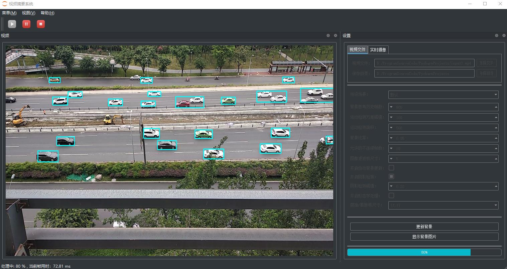
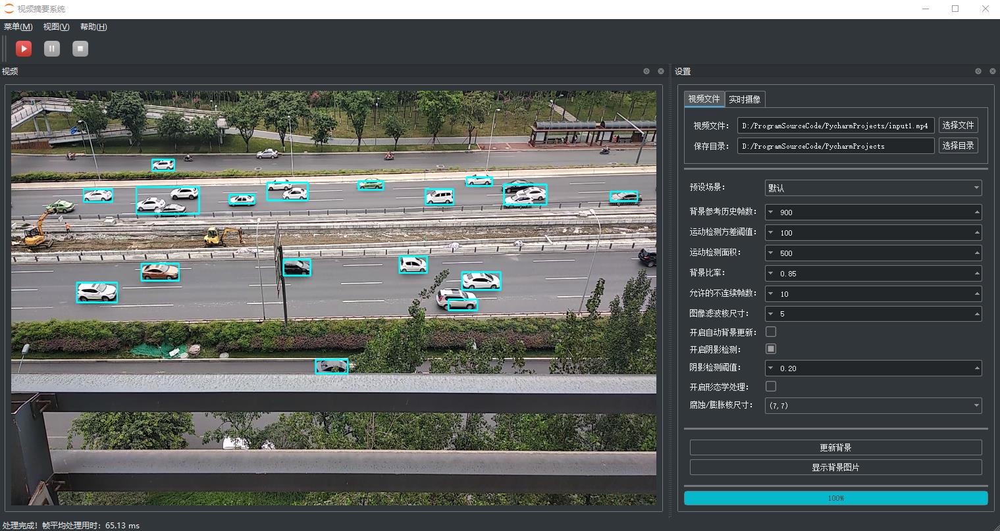
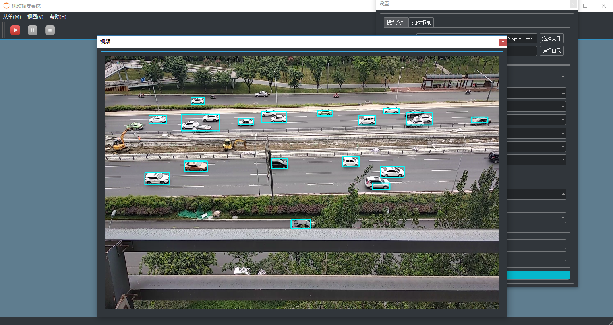

# [video_proc](https://github.com/Mainvooid/video_proc)
[]()


## 介绍

一个运动视频摘要Demo,基于PyQt5以及OpenCV.打包工具Pyinstaller.也可以作为PyQt5项目的模板.

## 目录结构
```
.
├─bin                     - 可执行文件目录
│  └─main                     - Pyinstaller打包结果目录
├─build                   - 构建目录
│  │  main.spec               - Pyinstaller配置文件(需要修改)
│  └─main                     - Pyinstaller打包临时目录
├─conf                    - 配置目录
│     resource.qrc            - PyQt5资源配置
│     settings.json           - 算法参数配置
│     window_status.ini       - 窗口位置配置
│
├─data                    - 数据目录(存放视频数据或者建模出来的背景图片)
├─docs                    - 项目文档目录
├─lib                     - 第三方库目录
├─log                     - 日志文件目录
├─res                     - 应用程序资源目录
├─src                     - 源码目录
│   ├─control                  - 控制器目录
│   │  │  logger.py               - 日志处理
│   │  │  main_controller.py      - 窗口控制
│   │  └─ settings.py             - 项目设置
│   ├─model                    - 模型目录
│   │  │  main_mod.py             - 主界面模型
│   │  └─ proc_thread.py          - 线程处理
│   └─view                     - 视图目录
│      │  dialog.ui               - 帮助页视图
│      │  main.ui                 - 主界面视图
│      │  resource_rc.py          - 项目图标资源
│      │  ui_dialog.py            - 帮助页布局
│      └─ ui_main.py              - 主界面布局
└─venv                    - 虚拟环境目录(环境由pipenv在项目外管理,必要时可拷贝一份在此)
```

## 使用方法
直接执行`main.py`

## 应用界面





## 扩展工具
将常用命令设置为扩展工具,以下供参考.
如果虚拟环境在根目录下,相关程序路径指定`$ProjectFileDir$\venv`
如果由pipenv管理,则类似在`C:\Users\用户名\.virtualenvs\项目名-n9RjFZIL`

- name: `requirements`
   - Description: `pip freeze > requirements.txt`
   - Program: `...\Python36\Scripts\pip.exe`
   - Arguments: `freeze > requirements.txt`
   - Working dir: `$FileDir$`
- name: `tree`
   - Description: `导出目录结构树`
   - Program:
   - Arguments: `tree /F > tree.txt`
   - Working dir: `$ProjectFileDir$`
- name: `grab-version`
   - Description: `获取exe版本信息文件`
   - Program: `...\Python\Python36\python.exe`
   - Arguments: `...\Python36\Lib\site-packages\PyInstaller\utils\cliutils\grab_version.py $FileName$`
   - Working dir: `$FileDir$`
- name: `QtDesigner`
   - Description: `启动视图编辑器`
   - Program: `...\Python36\Lib\site-packages\PyQt5\Qt\bin\designer.exe`
   - Arguments:
   - Working dir: `$FileDir$`
- name: `PyUIC`
   - Description: `.ui转为.py(py36)`
   - Program: `...\Python36\python.exe`
   - Arguments: `-m PyQt5.uic.pyuic  $FileName$ -o ui_$FileNameWithoutExtension$.py`
   - Working dir: `$FileDir$`
- name: `Pyrcc5`
   - Description: `pyrcc5 qrcfile.qrc -o  pyfile.py`
   - Program: `...\Python36\Scripts\pyrcc5.exe`
   - Arguments: `$FileName$ -o $FileNameWithoutAllExtensions$.py`
   - Working dir: `$FileDir$`
- name: `pyinstaller(video-proc,spec)`
   - Description: `直接执行spec文件打包`
   - Program: `...\Scripts\pyinstaller.exe`
   - Arguments: `-y --workpath=$ProjectFileDir$\build --distpath=$ProjectFileDir$/bin $FileName$`
   - Working dir: `$FileDir$`
- name: `pyinstaller(video-proc,文件夹,debug)`
   - Description: `生成可执行文件夹(py36,video_proc定制,debug版,去掉--onefile)`
   - Program: `...\Scripts\pyinstaller.exe`
   - Arguments: `--noconfirm --clean  --windowed --specpath=$ProjectFileDir$\build --workpath=$ProjectFileDir$\build --distpath=$ProjectFileDir$\bin --icon=$ProjectFileDir$\res\$FileNameWithoutExtension$.ico --version-file=$ProjectFileDir$\res\file_version_info.txt  --add-binary=$ProjectFileDir$\lib\opencv_ffmpeg400_64.dll;./  --add-binary=$ProjectFileDir$\lib\openh264-1.8.0-win64.dll;./ --add-data=$ProjectFileDir$\conf\settings.json;./conf --paths=C:\Users\用户名\.virtualenvs\video_proc-n9RjFZIL\Lib\site-packages\PyQt5\Qt\bin;$ProjectFileDir$\res;$ProjectFileDir$;$ProjectFileDir$\lib;$ProjectFileDir$\core;$ProjectFileDir$\core\view;$ProjectFileDir$\core\model;$ProjectFileDir$\core\control;$ProjectFileDir$\conf $FileName$`
   - Working dir: `$FileDir$`
- name: `pyinstaller(video-proc,文件夹,Release)`
   - Description: `生成可执行文件夹(py36,video_proc定制,去掉--onefile --windowed)`
   - Program: `...\Python36\Lib\site-packages\PyQt5\Qt\bin\designer.exe`
   - Arguments:`--noconfirm --clean --specpath=$ProjectFileDir$\build --workpath=$ProjectFileDir$\build --distpath=$ProjectFileDir$\bin --icon=$ProjectFileDir$\res\$FileNameWithoutExtension$.ico --version-file=$ProjectFileDir$\res\file_version_info.txt  --add-binary=$ProjectFileDir$\lib\opencv_ffmpeg400_64.dll;./  --add-binary=$ProjectFileDir$\lib\openh264-1.8.0-win64.dll;./ --add-data=$ProjectFileDir$\conf\settings.json;./conf --paths=C:\Users\用户名\.virtualenvs\video_proc-n9RjFZIL\Lib\site-packages\PyQt5\Qt\bin;$ProjectFileDir$\res;$ProjectFileDir$;$ProjectFileDir$\core;$ProjectFileDir$\core\view;$ProjectFileDir$\core\model;$ProjectFileDir$\core\control;$ProjectFileDir$\conf;$ProjectFileDir$\lib $FileName$`
   - Working dir: `$FileDir$`
- name: `pyinstaller(video-proc,单文件,Debug)`
   - Description: `生成单一可执行文件(py36,video_proc定制)`
   - Program: `...\Scripts\pyinstaller.exe`
   - Arguments: `--noconfirm --clean --onefile --windowed --specpath=$ProjectFileDir$\build --workpath=$ProjectFileDir$\build --distpath=$ProjectFileDir$\bin --icon=$ProjectFileDir$\res\$FileNameWithoutExtension$.ico --version-file=$ProjectFileDir$\res\file_version_info.txt  --add-binary=$ProjectFileDir$\lib\opencv_ffmpeg400_64.dll;./  --add-binary=$ProjectFileDir$\lib\openh264-1.8.0-win64.dll;./ --add-data=$ProjectFileDir$\conf\settings.json;./conf --paths=C:\Users\用户名\.virtualenvs\video_proc-n9RjFZIL\Lib\site-packages\PyQt5\Qt\bin;$ProjectFileDir$\res;$ProjectFileDir$;$ProjectFileDir$\core;$ProjectFileDir$\core\view;$ProjectFileDir$\core\model;$ProjectFileDir$\core\control;$ProjectFileDir$\conf;$ProjectFileDir$\lib $FileName$`
   - Working dir: `$FileDir$`


